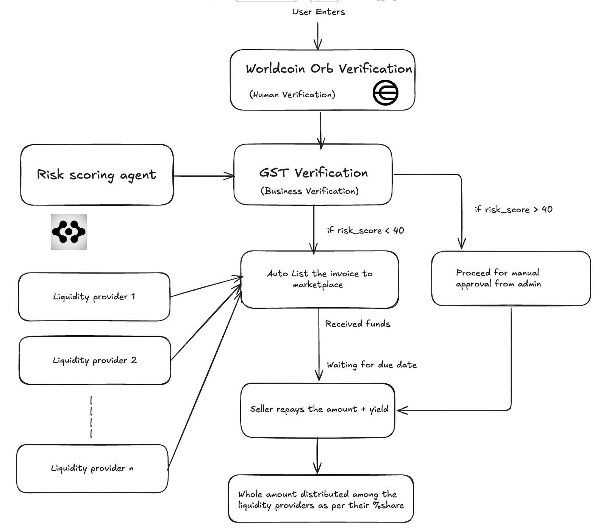

# Decentralized Invoice Financing Platform (InvoiceSME)

## Project Abstract

InvoiceSME is a decentralized finance (DeFi) platform designed to address critical working capital gaps for Small and Medium-sized Enterprises (SMEs). It operates as a two-sided marketplace:

- **Sellers (SMEs):** Tokenize their real-world, unpaid invoices as on-chain assets (ERC1155 tokens) to access immediate liquidity.
- **Investors (DeFi Users):** Purchase tokenized invoices at a discount, providing upfront capital to SMEs and earning a stable, asset-backed yield upon repayment.

The platform integrates an automated AI risk-scoring engine, on-chain seller verification, and an admin review panel to ensure the quality and security of listed assets.

## Core Features

- **Invoice Tokenization:** Invoices are minted as fractionalized ERC1155 tokens, with token supply corresponding to the funding amount.  
- **Decentralized Marketplace:** A public marketplace where investors can browse and fund listed invoices.  
- **Automated Risk Scoring:** AI-powered service (`/api/risk-check`) analyzes invoice and seller data to generate a risk score.  
- **Dynamic Listing Logic:** Invoices with low risk scores (≤ 40) are automatically listed; high-risk invoices are sent to the admin panel for manual review.  
- **On-Chain Verification:** Multi-step verification for sellers, including unique human verification (World ID) and business verification.  
- **User Portfolios:** Dashboards to track "My Invoices" for sellers and "Invoices I've Invested In" for investors.  
- **End-to-End Fund Lifecycle:**
  1. `createInvoice`: Verified seller mints invoice.  
  2. `processVerificationResult`: Off-chain service submits risk score.  
  3. `approveForListing`: Admin manually approves high-risk invoices.  
  4. `executeInvestment`: Investor funds the invoice, transferring PYUSD to the seller and receiving invoice tokens.  
  5. `repayInvoice`: Seller repays the full invoice amount (in PYUSD).  
  6. `claimRepayment`: Investors burn invoice tokens to claim their proportional repayment.

## System Architecture

Below is the high-level architecture of the InvoiceSME platform:



The project is a full-stack monorepo with three main components:

### Frontend (Next.js)

- Location: `/frontend`  
- React-based application using the Next.js App Router.  
- Connects to user wallets via Web3Provider (Web3.js).  
- UI components for marketplace, portfolio, admin panel, and invoice creation.

### Smart Contracts (Solidity/Hardhat)

- Location: `/contracts`  
- Core logic in `InvoiceSME.sol`, an ERC1155 and Ownable contract.  
- Manages on-chain logic, including minting, transfers, and invoice states (Pending, ManualReview, Listed, Funded, Repaid, Closed).

### Backend (Python)

- Location: `/asi_agent`  
- ASI Agent (`/asi_agent`) provides API endpoints:  
  - `/api/risk-check`: Performs complex risk analysis using the Python AI agent. 

## Local Setup and Installation

### Prerequisites

- Node.js (v18 or later)  
- Yarn or npm  
- Python (for AI agent)  
- Local blockchain (e.g., Hardhat Node)  
- `.env` file with necessary keys (Pinata API keys, wallet private key, etc.)  

### Smart Contract Deployment

```bash
cd /
npm install
npx hardhat node
npx hardhat run scripts/deploy.js --network localhost
